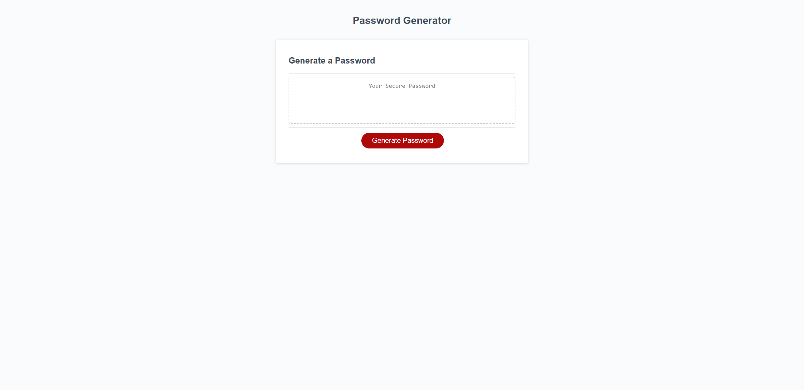

## Password Generator V1
 
This website is a randomized password generator. This websites goal to accomplish was to prompt the user to answer a series of questions with criteria for the password to be generated upon.
Questions asked varied from "How many character length do you want your password to be" to "Would you like to include uppercase characters?". These questions helped the generator make a password
based on the criteria the user prompted. A user can create a password with only Numbers, only lowercase chars, only uppercase and only special chars. A user can have any variation of these including all of them together.
I hope this website helps to best serve anyone who is having difficulty creating their own password. 

## Link to Website:

## Screenshot of Working Website: 

## Credit:
All techniques used in this website are derived from SMU Coding Boot Camp, Online Internet Resources and reddit.

## Update:
Last Updated 9/25/2023
